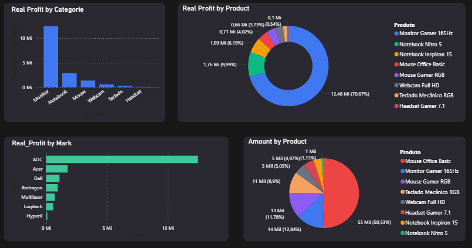
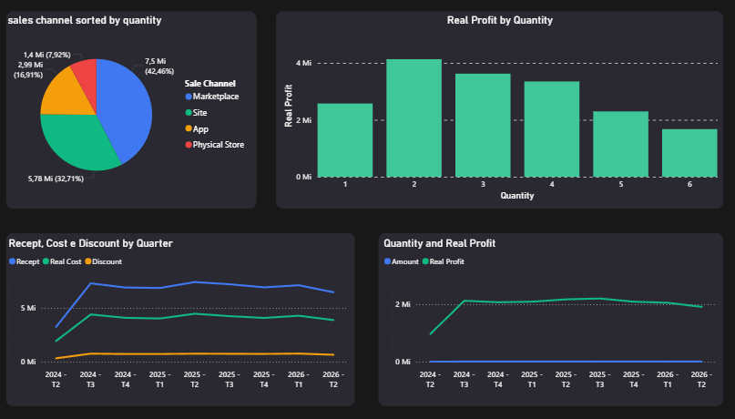

   # Creating a Data Analysis Portfolio 

A project designed to simulate a real-world sales scenario and demonstrate data cleaning and data analysis skills.

   ## Project Pipeline

 Raw Excel tables.   
         ↓  
 Data cleaning.  
         ↓  
 Outlier removal.  
         ↓  
 Use of SQL tool to make insights.  
         ↓  
 Creation of classifications on the tables using CASE.  
         ↓  
 Use of Pandas to make insights.   
         ↓  
 Normalization.    
         ↓  
 Use of Python to make scores.  
         ↓  
 Conversion of CSV to XLSX.  
         ↓  
 Creation of tables on PowerBI.  
         ↓  
 Creation of the README.  

   # Business Insights

 1.What is the customer persona.  
 2.Which type of city is the most profitable? 
 3.The most profitable brand, category and product.  
 4.What is the most stable city, product, category, marital status, etc.  
 5.Which group performs best in terms of growth?  

   ## Dataset

 1.Tables of correlations.  
 2.Tables of descriptions.  
 3.Product table.  
 4.Client table.  
 5.Fact Sales table.  
 6.City table.  
 7.XLSX tables to communicate with the Excel and PowerBI.  
 8.Score Tables.  

   ## Technologies Used 

1.Python.  
2.SQL.  
3.Pandas.  
4.Sklearn.  
5.Numpy.  
6.PowerBI.  
7.Excel.  


   ## Data Cleaning

1.Outlier removal using IQR.  
2.Missing object values handling.  
3.Treatment of missing numeric values using CV.     
4.Correction of the data type.  

   ## Scoring System 

1.The Probability of Growth represents the percentage of Month-over-Month (MoM) periods in which revenue increased compared to the previous month(Growth).  

2.Total profit represents the total profit generated by the analyzed entity during the selected period. It measures its contribution to the overall profit(Impact).  

3.Average variation measures the average Month-over-Month (MoM) percentage change in profit over the analyzed period(Growth).  

4.Volatility measures the standard deviation of the Month-over-Month (MoM) profit variation. Lower values indicate greater stability(Stability).  

5.Coefficient of Variation (CV) measures the relative dispersion of profit by dividing the standard deviation by the mean. Lower values indicate more consistent performance(Stability).  

   # Insights

1.Based on these parameters, the cities did not achieve strong scores in either the conservative or growth rankings. This indicates an issue with the sales profile in each city, as most sales (60%) consist of low-priced products rather than high-priced ones, which are significantly more profitable and have higher profit margins. Increasing the share of high-margin products could improve the cities' scores.

2.The scores based on population classification performed significantly better than the city scores. Cities with populations of 9 million or more are more stable and have a higher potential for growth. Investing in these cities is likely to be more profitable.

| Classification_popula   |   prob_grow |   total_profit |   volatility |    CV |  growth score |
|:-----------------------|------------:|---------------:|-------------:|------:|--------:|
| Very Big               |         1   |          0.942 |        0.577 | 1     |   0.94  |
| Big                    |         1   |          0.994 |        1     | 0.424 |   0.883 |
| Average                |         0   |          1     |        0.631 | 0.257 |   0.414 |
| Small                  |         0.5 |          0     |        0     | 0     |   0.2   |

| Classification_popula   |   prob_grow |   total_profit |   volatility |    CV |  conservative score |
|:-----------------------|------------:|---------------:|-------------:|------:|--------:|
| Very Big               |         1   |          0.942 |        0.577 | 1     |   0.867 |
| Big                    |         1   |          0.994 |        1     | 0.424 |   0.769 |
| Average                |         0   |          1     |        0.631 | 0.257 |   0.392 |
| Small                  |         0.5 |          0     |        0     | 0     |   0.1   |

3.The Expensive and Very Expensive categories generated similar revenue, but the Expensive category produced four times more profit. This indicates that investing in Expensive products ($1,000–$3,000) is more profitable than investing in Very Expensive products ($3,000–$7,000) or any other price category.

4.The Monitor Gamer 165Hz performed very well in both the growth and conservative scores and represents the entire Expensive category. This product accounts for 12% of total sales but 70% of total profit. Based on its profit per unit, increasing the discount from 12% to 30% to achieve, for example, a 5% increase in sales (695 additional units) would generate an additional profit of $385,392.86. Therefore, investing in discounts and marketing for this product is promising, especially since it is not the best-selling product. The Mouse Office Basic accounts for 50% of total sales, indicating that the Monitor Gamer 165Hz still has significant room for growth.



| Product Category | Revenue | Cost | Profit | Profit Margin (%) |
|------------------|---------:|-------:|-------:|--------------------:|
| Very Expensive   | 23,166,607 | 19,929,668 | 3,236,939 | 13.97 |
| Mean             | 6,608,183 | 5,542,896 | 1,065,287 | 16.12 |
| Cheap            | 4,583,110 | 3,007,425 | 1,575,684 | 34.38 |
| Expensive        | 24,568,887 | 10,568,141 | 14,000,746 | 56.99 |

```python
quant = produto['Quantidade'].sum()
profit = (
    (produto['Preco_Unitario'] * produto['Quantidade'] * 0.70)
    - (produto['Custo_Unitario'] * produto['Quantidade'])
).sum()

profit_by_unit = profit / quant

cenarios = [0.05, 0.10, 0.20]

for c in cenarios:
    new_units = quant * c
    lucro_extra = new_units * profit_by_unit

    print(f"{c:.0%} of growth:")
    print(f"New units: {new_units:.0f}")
    print(f"Adicional profit: R$ {lucro_extra:,.2f}\n")
```

| Product              |   prob_grow |   total_profit |   variation_mean |   volatility |    CV |   conservative score |
|:---------------------|------------:|---------------:|-----------------:|-------------:|------:|--------:|
| Monitor Gamer 165Hz  |       0.5   |          1     |            0     |        0.952 | 1     |   0.936 |
| Mouse Office Basic   |       1     |          0.05  |            0     |        1     | 0.92  |   0.778 |
| Mouse Gamer RGB      |       0.667 |          0.046 |            0.017 |        0.923 | 0.951 |   0.733 |

| Product              |   prob_grow |   total_profit |   volatility |    CV |  growth score |
|:---------------------|------------:|---------------:|-------------:|------:|--------:|
| Monitor Gamer 165Hz  |       0.5   |          1     |        0.952 | 1     |   0.795 |
| Mouse Office Basic   |       1     |          0.05  |        1     | 0.92  |   0.699 |
| Webcam Full HD       |       0.833 |          0.038 |        0.75  | 0.988 |   0.618 |

5.The most profitable order quantities are 2, 3, and 4 units, with 2 units being the closest to the average order quantity. Additionally, orders containing 2 units represent the highest sales volume across all price ranges, including the Expensive and Very Expensive categories. A good investiment would be to offer a discount of 30%, like it was said before, when you buy two Monitors Gamers 165Hz, for example.



## Persona 

1.Married customers ranked first in both the conservative and growth analyses. This segment combines the highest profitability with strong growth potential, making it the most valuable customer group. Divorced customers stand out for growth potential but currently generate lower profits, whereas single customers are profitable but show limited growth prospects.

| Marital_Status   |   prob_grow |   total_profit |   volatility |    CV |  conservative score |
|:---------------|------------:|---------------:|-------------:|------:|--------:|
| Married         |       0.667 |          1     |        1     | 0.438 |   0.708 |
| Single       |       0     |          0.757 |        0     | 1     |   0.476 |
| Divorced     |       1     |          0     |        0.542 | 0     |   0.362 |

| Marital_Status   |   prob_grow |   total_profit |   volatility |    CV |  growth score |
|:---------------|------------:|---------------:|-------------:|------:|--------:|
| Married         |       0.667 |          1     |        1     | 0.438 |   0.754 |
| Divorced     |       1     |          0     |        0.542 | 0     |   0.454 |
| Single       |       0     |          0.757 |        0     | 1     |   0.427 |

2.The Average Registration category (2023–2024) ranked first in both scoring models. Although its probability of growth is not very high, the greater weight assigned to total revenue can significantly improve its Growth Score. In the Conservative Score, this category is the clear leader.

The Average Registration group contains 7,977 customers, followed by 6,552 old customers (2021–2022) and 5,471 new customers (2025–2026). Over time, customers naturally move into older registration categories, so the business should adopt a strategy to continuously attract new customers.

One possible strategy is to offer an additional 10% discount on a purchase to customers who successfully refer 10 unregistered people. Assuming that 20% of the current customers (4,000 people) participate, they would reach 40,000 potential customers. If 10% (4,000 people) of those prospects become new customers, this would represent a 73.1% increase over the current 5,471 new customers.

The participating customers are assumed to make an average of two purchases each, resulting in an estimated 8,000 sales eligible for the additional 10% discount. Even under this scenario, the estimated profit would still be $1,938,546.41. However, as shown in the table below, some products would become unprofitable under this discount policy.


```python
top10 = df['Produto'].value_counts()
print(top10)

proporcion = top10 / top10.sum()
print(proporcion)

new_sales = 8000

estimative = (proporcion * new_sales).round().astype(int)

print(estimative)

df['Lucro_Real_10'] = (
    df['Lucro_Real']
    - (df['Preco_Unitario'] * df['Quantidade'] * 0.10)
)

mean_profit = (
    df.groupby('Produto')['Lucro_Real_10']
      .mean()
)

mean_profit = mean_profit.loc[top10.index]

print(mean_profit)

estimative_profit = mean_profit * estimative
```


| Product              |  Profit                |
|:---------------------|-----------------:|
| Mouse Office Basic   |  74,898           |
| Monitor Gamer 165Hz  |      1,654,040 |
| Mouse Gamer RGB      |  76,623           |
| Teclado Mecânico RGB |  -8,779.03        |
| Webcam Full HD       |  72,308.1         |
| Headset Gamer 7.1    | -16,973.2         |
| Notebook Inspiron 15 | -85,445           |
| Notebook Nitro 5     | 171,876           |

| Registration_Category   |   prob_grow |   total_revenue |   volatility |    CV |  conservative score |
|:---------------------|------------:|---------------:|-------------:|------:|--------:|
| Average              |       0.333 |          1     |        1     | 0.941 |   0.843 |
| Recent               |       0     |          0     |        0.504 | 1     |   0.551 |
| old                  |       1     |          0.467 |        0     | 0     |   0.247 |

| Registration_Category   |   prob_grow |   total_revenue |   volatility |    CV |  growth score |
|:---------------------|------------:|---------------:|-------------:|------:|--------:|
| Average              |       0.333 |          1     |        1     | 0.941 |   0.721 |
| old                  |       1     |          0.467 |        0     | 0     |   0.54  |
| Recent               |       0     |          0     |        0.504 | 1     |   0.25  |

3.There are 12,731 adults, 5,293 elderly, and 1,355 young customers. Adults generate the highest number of sales, while the elderly category has the highest month-over-month (MoM) growth probability. However, its Growth Score is only slightly higher than the others, indicating that the probability of growth has a strong influence on the score, whereas the remaining metrics are not significantly better.

There is also a strong relationship between the Average Registration category, High Salary, and the Adult age group. Therefore, these groups overlap substantially, and strategies targeting the Average Registration or High Salary categories are likely to reach a large proportion of Adult customers.

The average customer age is 44 years, with a standard deviation of 18.3 years and a coefficient of variation (CV) of 41.6%, indicating relatively high variability. Therefore, age should not be considered the primary parameter for decision-making.

| Age_Range   |   prob_grow |   total_revenue |   volatility |    CV |  conservative score |
|:---------------|------------:|---------------:|-------------:|------:|--------:|
| Adult          |       0     |          1     |        1     | 0.987 |   0.795 |
| Elderly        |       1     |          0.374 |        0.873 | 0.237 |   0.594 |
| Young          |       0     |          0.055 |        0.384 | 1     |   0.521 |

| Age_Range   |   prob_grow |   total_revenue |   volatility |    CV |  growth score |
|:---------------|------------:|---------------:|-------------:|------:|--------:|
| Elderly        |       1     |          0.374 |        0.873 | 0.237 |   0.647 |
| Adult          |       0     |          1     |        1     | 0.987 |   0.597 |
| no value       |       0.667 |          0     |        0     | 0     |   0.267 |
| Young          |       0     |          0.055 |        0.384 | 1     |   0.255 |

4.People with high salaries ($9,000–$18,000) perform well in terms of probability of growth, total revenue, and volatility, while very high salary customers ($18,000 or more) do not perform as well on conservative metrics. This group of high salaries does not purchase more expensive products; they simply buy more. Their average profit is $155.97 and their median profit is $17.62, which is practically the same as the other salary categories.

High-salary customers account for 35.66% of the total profit, making them the most profitable salary category. Within this group, the top 3% of sales generate 41% of the profit, not only for this category but across the entire dataset.

A valuable opportunity is to identify the customers responsible for these top 3% of sales, create a dedicated Dim_Client table for them, provide special treatment, improve communication through an exclusive group, and develop customized products for these VIP customers.

```python
faixa = df[df['Categoria_Renda'] == 'Alta']

limit = faixa['Lucro_Real'].quantile(0.97)

Total_Profit = faixa['Lucro_Real'].sum()
Big_Sales = faixa[faixa['Lucro_Real'] >= limit]
Big_Sales1 = df[df['Lucro_Real'] >= limit]
Other_Sales = faixa[faixa['Lucro_Real'] < limit]
Other_Profit = Other_Sales['Lucro_Real'].sum()

Profit_3percent = Big_Sales['Lucro_Real'].sum()
var2= Big_Sales['Lucro_Real'].mean()
var3= Big_Sales['Lucro_Real'].std()
var4= Big_Sales['Lucro_Unidade'].median()
cv2= var3/var2
var5 = Profit_3percent/Total_Profit

print("CV:",cv2)
print("3percent of the sales:",Profit_3percent)
print("Mean:",var2)

print("Top 3%:", Profit_3percent)
print("Others 97%:", Other_Profit)
print("Total:", Profit_3percent + Other_Profit)
print(" 3%",var4)
print("%",var5)
```

| Salary_Range   |   prob_grow |   total_revenue |   volatility |    CV |  growth score |
|:------------------|------------:|---------------:|-------------:|------:|--------:|
| High              |           1 |          1     |        1     | 0.53  |   0.906 |
| Very Hight        |           1 |          0.632 |        0.427 | 0.221 |   0.676 |
| Low             |           1 |          0     |        0     | 1     |   0.6   |
| Mean             |           0 |          0.409 |        0.727 | 0     |   0.195 |

| Salary_Range   |   prob_grow |   total_revenue |   volatility |    CV |  conservative score |
|:------------------|------------:|---------------:|-------------:|------:|--------:|
| High              |           1 |          1     |        1     | 0.53  |   0.812 |
| Low             |           1 |          0     |        0     | 1     |   0.6   |
| Very High        |           1 |          0.632 |        0.427 | 0.221 |   0.48  |
| Mean             |           0 |          0.409 |        0.727 | 0     |   0.259 |

5.The most valuable customer profile is the combination of an old or average registration category, adult age group, and high salary. Adults are present in all of the most profitable groups, while the old and average registration categories appear in most of them. This suggests that customers with longer registration histories are generally more profitable. Based on the other scores and analyses, the ideal customer is approximately 44 years old, belongs to the average registration category, is married, has a high salary, and can be either male or female.

| Registration Category | Age Group | Salary Category | Sales | Real Profit |
|-----------------------|-----------|----------------:|------:|------------:|
| Old | Adult | High | 8,998 | 614,673.61 |
| Average | Adult | Very High | 8,359 | 593,203.03 |
| Average | Adult | High | 10,909 | 581,063.95 |
| Average | Adult | Medium | 7,326 | 467,304.67 |
| Old | Adult | Very High | 6,671 | 431,638.17 |
| Recent | Adult | Medium | 5,173 | 431,417.55 |
| Recent | Adult | Very High | 5,482 | 378,207.24 |
| Old | Adult | Medium | 5,655 | 345,900.58 |

## Recommendations

To improve future analyses and support more accurate business decisions, the following additions are recommended:

1.Marketing Table: Include marketing campaign data (campaign type, investment, channel, and period). This would allow the calculation of ROI, customer acquisition cost (CAC), campaign effectiveness, and the impact of marketing on sales growth.

2.Separated Cost Structure: Split the product cost into categories such as manufacturing, logistics, taxes, and operational costs. This would enable more detailed profit analyses and help identify where costs can be reduced.

3.Tax Information: Include tax data to calculate net profit instead of only gross operational profit.

4.Inflation Data: Incorporate inflation indicators to evaluate revenue and profit growth in real terms rather than nominal values.

5.Additional Growth Metrics: Add metrics such as customer retention, purchase frequency, customer lifetime value (CLV), and revenue growth by customer segment to improve the scoring model.